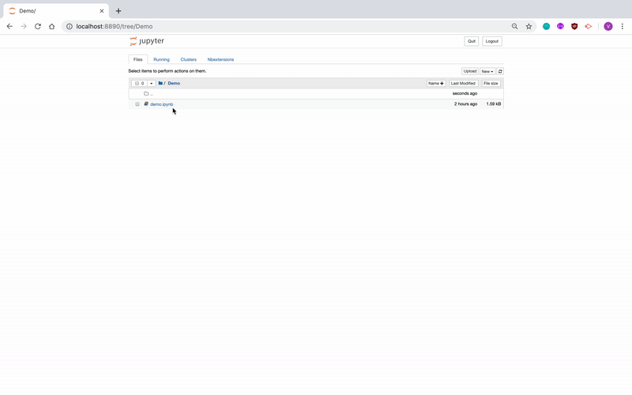
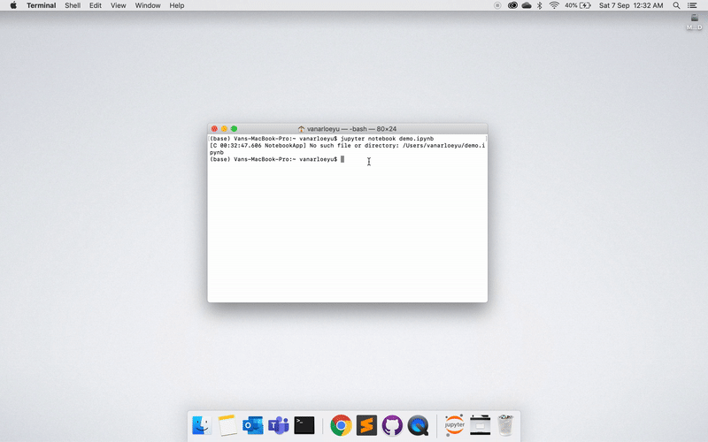
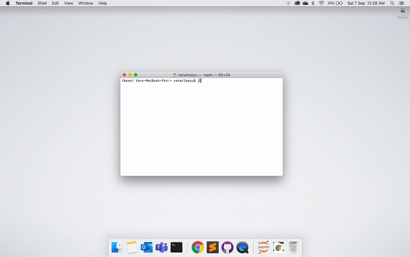
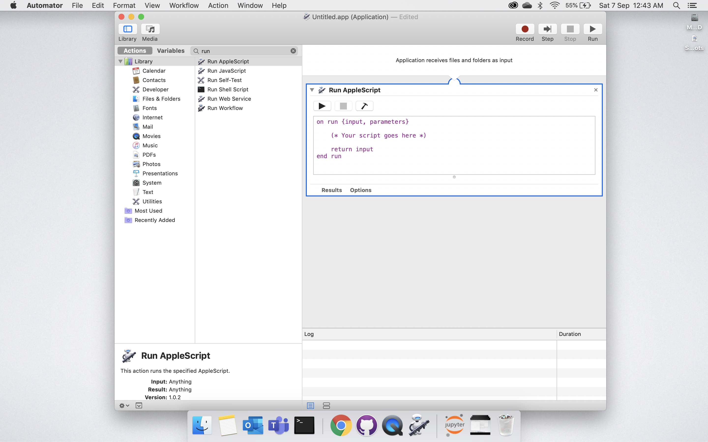
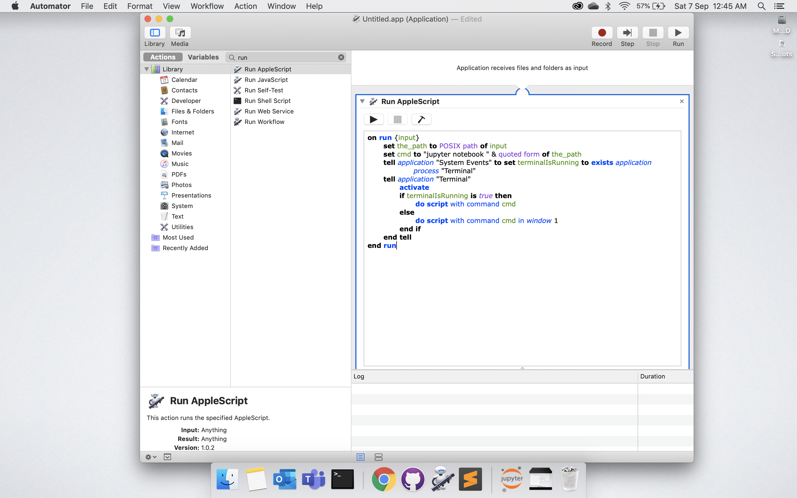
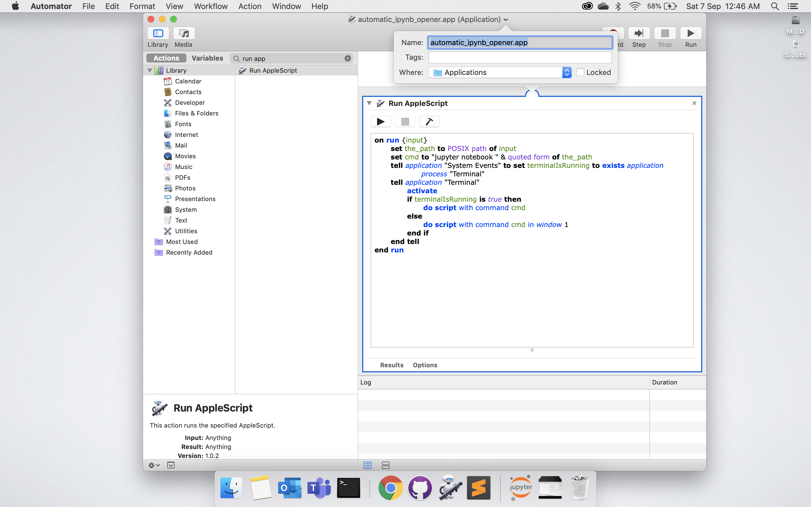
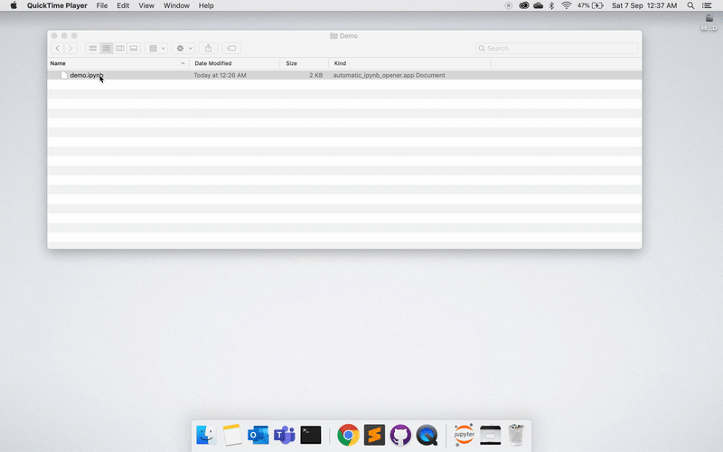

# How to automatically open your Jupyter Notebook (.ipynb) file with a double click?
Have you ever experienced the hassle of opening an Jupyter Notebook (.ipynb) file? If you've worked with Jupyter Notebooks before you've probably had. To ease the hassle, I have created an **Automator AppleScript that will open your ipynb file directly as a Jupyter Notebook in your browser.** The solution presented however is only compatible with Mac OS.


## Two usual ways of opening an ipynb file
  1. Opening in the Jupyter Notebook Environment
  
      

  2. Opening through the terminal by entering:
      
      ```jupyter notebook ~/filepath/filename.ipynb```
      
      

     Note that you have to be in the directory of the file to open the Jupyter Notebook.
     
      

## Your step by step guide to open your Jupyter Notebook (.ipynb) file with a double click
The solution created was based on the second method mentioned above and ghoppe's answer in https://superuser.com/questions/139352/mac-os-x-how-to-open-vim-in-terminal-when-double-click-on-a-file. Below are the detailed steps for the automator solution.
  1. Open "Automator.app" from your Finder
  
      
      
  2. Create a "New Document"
  
      
      
  3. Choose "Application"
  
      

  4. Find and select "Run AppleScript"
  
      

  5. Paste the code in the AppleScript
  
      

    ```
    on run {input}
       set the_path to POSIX path of input
       set cmd to "jupyter notebook " & quoted form of the_path
       tell application "System Events" to set terminalIsRunning to exists application process "Terminal"
       tell application "Terminal"
          activate
          if terminalIsRunning is true then
             do script with command cmd
          else
             do script with command cmd in window 1
          end if
       end tell
    end run
    ```

  6. Save as "automatic_ipynb_opener.app" or any desired name for your app
  
      

  7. Go to any .ipynb file, open "Get Info" and select "Other..." under "Open with"
  
      
      
      

  8. Find and select your app and tick "Always Open With"
  
      

  9. Click "Change All..."
  
      

  10. Check and confirm the automator by double-clicking your .ipynb file
  
      

That's it! You now have an Automator AppleScript that will open your ipynb file directly as a Jupyter Notebook in your browser. You are now saved from seconds, minutes, or even hours of non-value adding activity. Enjoy!

## Reference: 

https://superuser.com/questions/139352/mac-os-x-how-to-open-vim-in-terminal-when-double-click-on-a-file

